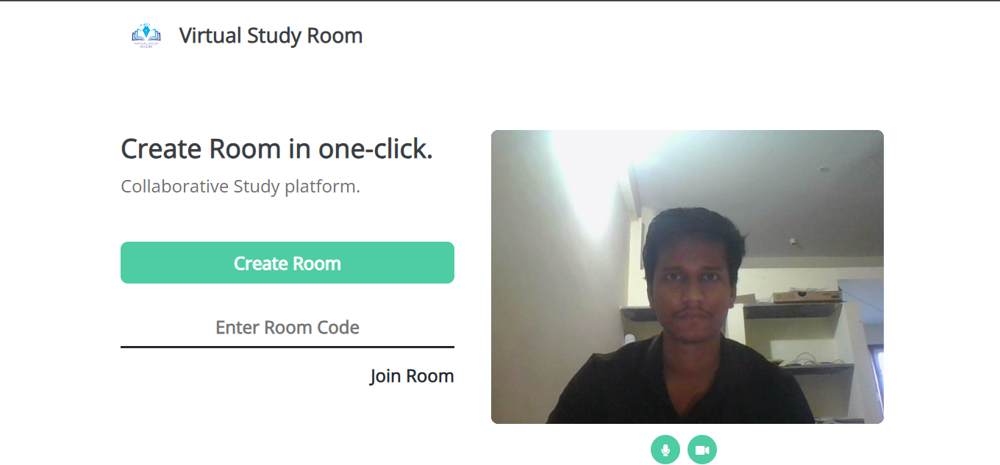
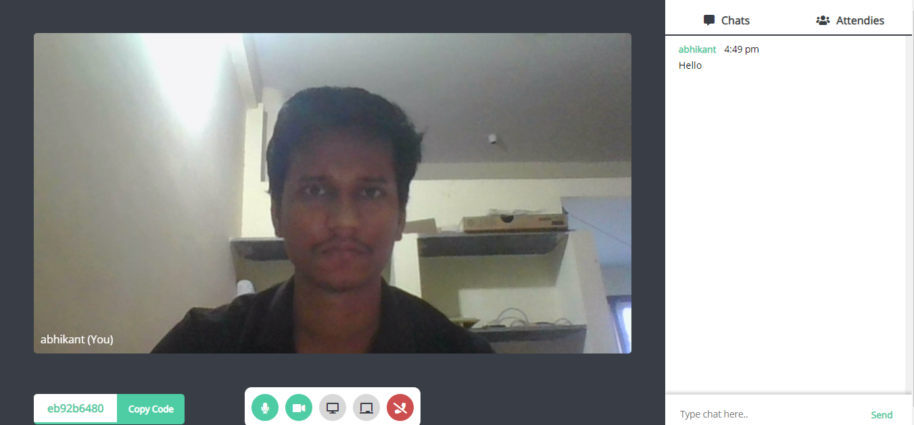

# Virtual Study Room
A video chat/meeting webapp using WebRTC and WebSockets (socket.io) including a collaborative whiteboard.

  

## Current Features?
1. Video Calls
2. Chatbox
3. Collaborative Whiteboard
4. Screensharing

## Upcoming Features?
1. List of attendees
2. Responsive front-end for Rooms

## Contributions?
Feel free to make a PR.
